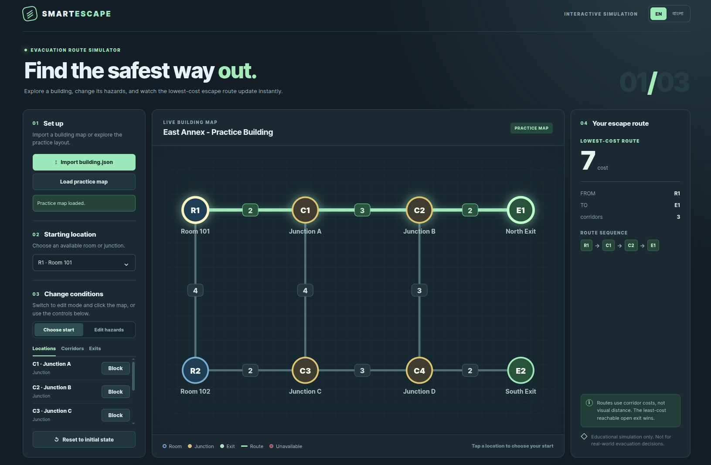
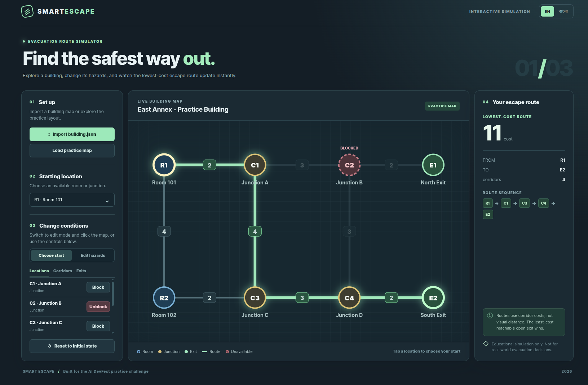

# Smart Escape

Interactive, browser-only evacuation route simulator for the AI DevFest 2026 practice challenge.

**Participant:** O.F.M. Rakibul Hasan  
**Registration:** 241-15-223  
**Public repository:** https://github.com/rakibulx33/AI-DEV-FEST-2026-VIBE-CODING-MOCK  
**Live website:** Pending GitHub Pages activation and verification

> This is a practice implementation prepared on 5 October 2026. The official rulebook says contest project code must be written and committed only after T+0 on 6 October 2026. This repository cannot be represented as an eligible contest submission without following that rule.

## Run

No installation or build is needed. Serve this directory with any static file server, then open the local URL in Chrome. For example:

```bash
python3 -m http.server 4173
```

Then open `http://localhost:4173`. The included official public `building.json` is preloaded as a practice map; use **Import building.json** to test another file. The app never uploads the file and uses no external API.

Run logic and interaction checks with:

```bash
npm test
```

## Main features

- Validates the building name, 2–60 typed nodes, 1–150 undirected weighted corridors, unique IDs, valid endpoints, positive integer costs, no self-loops or repeated node pairs, and all initial hazard references.
- Draws rooms, junctions, exits, and corridor costs at supplied display coordinates in a responsive SVG map.
- Finds the lowest-cost route from an available room or junction to any reachable open exit. Equal-cost exits use the smallest exit ID; equal-cost paths to that exit use the smallest node-ID sequence.
- Blocks and unblocks locations and corridors, closes and reopens exits, and recalculates immediately. Reset restores the imported file's `initial_state` while keeping the selected start.
- Reports blocked starts and unreachable exits clearly. Offers English and Bangla modes, keyboard-operable map controls, and brief route and selection animations.

## Bonus features

- Built-in official practice sample, interactive map editing, keyboard map controls, reduced-motion support, and local language preference.

## Sample checks

The included `building.json` is the official public practice sample supplied with the mock challenge. The tests cover all five published outcomes:

| Scenario | Expected result |
| --- | --- |
| Select R1 | `R1 → C1 → C2 → E1`, cost 7 |
| Block C2 after selecting R1 | `R1 → C1 → C3 → C4 → E2`, cost 11 |
| Close E1 and E2 | No route available |
| Select R2 | `R2 → C3 → C4 → E2`, cost 7 |
| Block selected R1 | Starting location blocked |

Additional tests cover equal-cost ties, disconnected graphs, blocked corridors, reset behavior, invalid input, import, hazard interaction, and language switching. A deterministic test also compares the route engine with an independent exhaustive search on 300 small graphs.

## Screenshots





## Deploy

The app is a static site. In this repository, open **Settings → Pages → Build and deployment → Source**, select **GitHub Actions**, and save. The included workflow publishes the site from `main`. After the workflow succeeds, open its reported HTTPS URL in Chrome and replace the pending live website line above with the verified URL.

## Known issues

- The map preserves node positions but dense or overlapping input coordinates may cause labels to overlap.
- GitHub Pages has not yet been activated and verified. The repository name is for this mock submission; the separate official contest rule requires a repository named `devfest-241-15-223` and code written during the contest window.

## AI use

**Tool:** OpenAI Codex.  
**Most useful prompt:** “Build the project and test and make a final submittable problem solution” with the supplied Smart Escape problem statement and official `building.json`.

AI was used to draft the interface, validation, routing, tests, and documentation. The participant is responsible for reviewing and explaining the result.
